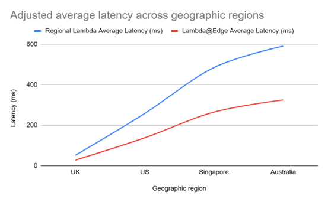
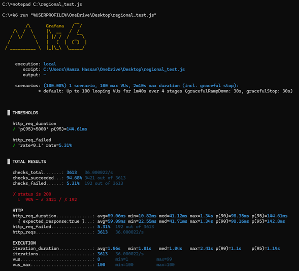
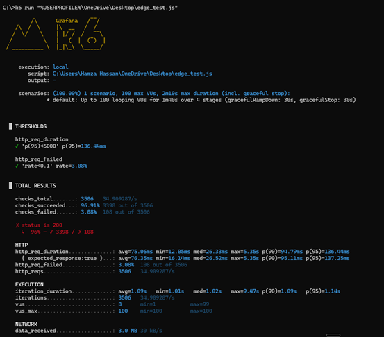

# AWS Lambda vs Lambda@Edge Performance Benchmark

A controlled experimental evaluation of Regional AWS Lambda and Lambda@Edge architectures using a dynamic product catalogue application deployed on AWS.

**Final Year Project – BSc Computer Science**  
**University of Westminster**

---

## Overview

This project investigates whether AWS Lambda@Edge provides meaningful performance advantages over a traditional Regional AWS Lambda deployment.

A dynamic product catalogue application was implemented using Amazon API Gateway, AWS Lambda, Amazon DynamoDB, Amazon CloudFront, and Lambda@Edge. Both architectures use identical business logic, datasets, filtering behaviour, and response structures to ensure a fair comparison.

The evaluation focuses on:

- Functional correctness
- Cold-start and warm-start behaviour
- Geographic latency
- CloudFront cache performance
- Concurrent load performance
- Monitoring and observability
- Operational cost

---

## Architecture

### Regional AWS Lambda Architecture


### Lambda@Edge Architecture


---

## Technology Stack

| Component | AWS Service / Tool |
|------------|-------------------|
| Compute | AWS Lambda |
| Edge Compute | Lambda@Edge |
| CDN | Amazon CloudFront |
| Database | Amazon DynamoDB |
| API Layer | Amazon API Gateway |
| Monitoring | Amazon CloudWatch |
| Load Testing | k6 |
| Version Control | GitHub |

---

## Sample Dataset

The application uses a DynamoDB product catalogue containing region-specific products across multiple categories.

| Region | Categories |
|----------|----------|
| UK | Laptop, Phone, Console |
| US | Laptop, Phone |
| SG | Phone, Tablet |
| AU | Laptop, Console |
| DE | Laptop, Tablet |

### DynamoDB Product Catalogue


---

## API Endpoints

### Regional AWS Lambda

**Base Endpoint**

```http
https://2l4jg1csu3.execute-api.eu-west-2.amazonaws.com
```

**Example Requests**

```http
https://2l4jg1csu3.execute-api.eu-west-2.amazonaws.com?region=UK

https://2l4jg1csu3.execute-api.eu-west-2.amazonaws.com?region=US

https://2l4jg1csu3.execute-api.eu-west-2.amazonaws.com?region=UK&category=laptop

https://2l4jg1csu3.execute-api.eu-west-2.amazonaws.com?region=US&category=phone
```

### Lambda@Edge + CloudFront

**Base Endpoint**

```http
https://d2asztbanmsq98.cloudfront.net/products
```

**Example Requests**

```http
https://d2asztbanmsq98.cloudfront.net/products?region=UK

https://d2asztbanmsq98.cloudfront.net/products?region=US

https://d2asztbanmsq98.cloudfront.net/products?region=UK&category=laptop

https://d2asztbanmsq98.cloudfront.net/products?region=US&category=phone
```

---

## Functional Validation

Both architectures were validated using repeated endpoint testing to ensure equivalent functionality before performance benchmarking was conducted.

Validated behaviours included:

- Region filtering
- Category filtering
- Combined filtering
- Invalid request handling
- JSON response structure validation
- DynamoDB integration

All functional test cases passed successfully across both deployment architectures.

---

## Geographic Latency Evaluation

The architectures were evaluated across multiple geographic locations to assess the impact of execution location and network distance on response times.

### Comparative Global Latency Results



The results demonstrated that response times for Regional AWS Lambda increased as distance from the deployment region grew, whereas the Lambda@Edge deployment maintained more consistent performance across geographically distributed locations.

---

## Concurrent Load Testing

Load testing was performed using **k6** to evaluate latency, throughput, consistency, and failure rates under concurrent workloads.

### Execute Regional Lambda Test

```bash
k6 run load-testing/regional_test.js
```

### Execute Lambda@Edge Test

```bash
k6 run load-testing/edge_test.js
```

### Regional Lambda Load Test Results



### Lambda@Edge Load Test Results



Metrics collected included:

- Average latency
- Median latency (P50)
- P90 latency
- P95 latency
- Throughput
- Failure rate
- Concurrent request handling

---

## Key Findings

### CloudFront Caching

Cache-hit responses consistently outperformed cache-miss requests, demonstrating the significant impact of caching on overall performance.

### Geographic Latency

Regional Lambda latency increased as distance from the deployment region grew. Lambda@Edge maintained more consistent response times across geographically distributed locations.

### Cold Starts

Cold starts introduced measurable latency overhead in both architectures, although execution times stabilised considerably during subsequent warm invocations.

### Architectural Trade-Offs

Lambda@Edge improved latency performance but introduced:

- Higher operational complexity
- Reduced observability
- Additional CloudFront and edge execution costs

Regional Lambda provided:

- Simpler deployment and maintenance
- Better debugging capabilities
- Improved monitoring visibility

---

## Repository Structure

```text
.
├── diagrams/
│   ├── centralised-serverless-architecture.png
│   └── edge-assisted-serverless-architecture.png
│
├── images/
│   ├── comparative-global-latency.png
│   ├── dynamodb-products.png
│   ├── k6-edgeassisted-load-results.png
│   └── k6-regional-load-results.png
│
├── lambda-regional/
│   └── index.js
│
├── lambda-edge/
│   └── index.js
│
├── load-testing/
│   ├── regional_test.js
│   └── edge_test.js
│
├── References.md
├── Bibliography.md
└── README.md
```

---

## Dissertation

This repository accompanies the final year dissertation:

> **AWS Lambda vs Lambda@Edge: A Controlled Performance Evaluation of Centralised and Edge-Assisted Serverless Architectures**

The study investigates how execution location, caching behaviour, network distance, and workload characteristics influence serverless application performance.

---

## References & Bibliography

- [References](References.md)
- [Bibliography](Bibliography.md)

---

## IPD Presentation Video

The recorded IPD presentation and project demonstration video are available below:

- [Benchmarking AWS Lambda vs Lambda@Edge](#)

*(Replace the placeholder link with your YouTube URL.)*

---

## Author

### Hamza Hassan

Final-Year Computer Science Student  
University of Westminster

Cloud & DevOps Engineering

### Connect With Me

- LinkedIn: https://www.linkedin.com/in/hamzahassan21/
- YouTube: https://www.youtube.com/channel/UC51JEAEBV8WXwf2ZLROvUJw

---

## Project Status

✅ Regional AWS Lambda implementation completed  
✅ Lambda@Edge implementation completed  
✅ DynamoDB integration completed  
✅ Functional validation completed  
✅ Geographic latency testing completed  
✅ Cold-start and warm-start analysis completed  
✅ Cache behaviour evaluation completed  
✅ Concurrent load testing completed  
✅ Dissertation completed
