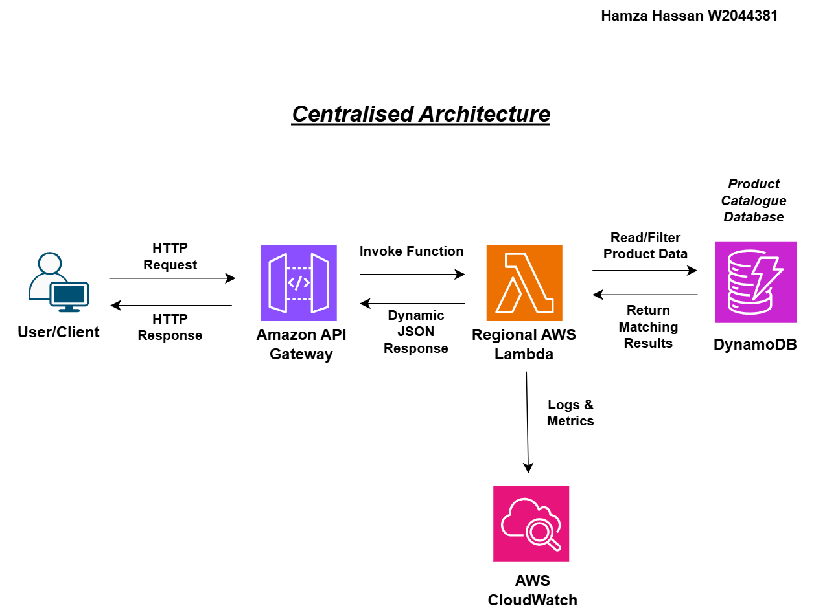
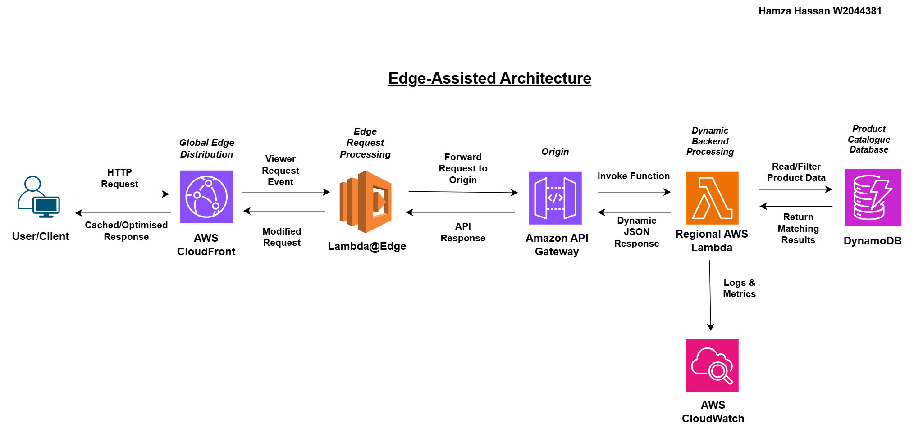
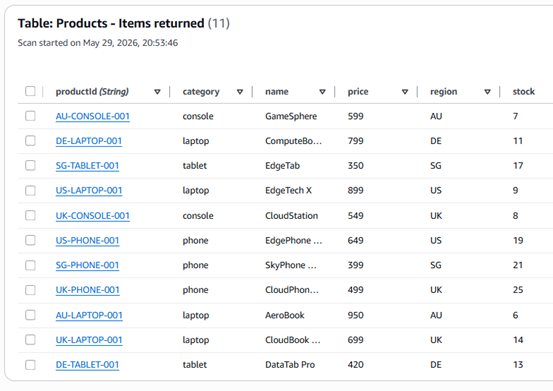

# AWS Lambda vs Lambda@Edge Performance Benchmark

A controlled experimental evaluation of Regional AWS Lambda and Lambda@Edge architectures using a dynamic product catalogue application deployed on AWS.

Final Year Project – BSc Computer Science
University of Westminster

## Overview

This project investigates whether AWS Lambda@Edge provides meaningful performance advantages over a traditional Regional AWS Lambda deployment.

A dynamic product catalogue application was implemented using Amazon API Gateway, AWS Lambda, Amazon DynamoDB, Amazon CloudFront and Lambda@Edge. Both architectures use identical business logic and datasets to ensure a fair comparison.

The study evaluates:

- Functional correctness
- Cold-start and warm-start behaviour
- Geographic latency
- CloudFront cache performance
- Concurrent load performance
- Monitoring and observability
- Operational cost

## Architecture

### Regional AWS Lambda Architecture



### Lambda@Edge Architecture



## Technology Stack

| Component | Service |
|------------|---------|
| Compute | AWS Lambda |
| Edge Compute | Lambda@Edge |
| CDN | Amazon CloudFront |
| Database | Amazon DynamoDB |
| API Layer | Amazon API Gateway |
| Monitoring | Amazon CloudWatch |
| Load Testing | k6 |
| Source Control | GitHub |

## Sample Dataset

The application uses a DynamoDB product catalogue containing region-specific products across multiple categories.

| Region | Categories |
|----------|----------|
| UK | Laptop, Phone, Console |
| US | Laptop, Phone |
| SG | Phone, Tablet |
| AU | Laptop, Console |
| DE | Laptop, Tablet |



## API Endpoints

### Regional AWS Lambda

```http
https://2l4jg1csu3.execute-api.eu-west-2.amazonaws.com

?region=UK
?region=US
?region=UK&category=laptop
?region=US&category=phone
```
### AWS Lambda@Edge 

```http
https://d2asztbanmsq98.cloudfront.net/products

?region=UK
?region=US
?region=UK&category=laptop
?region=US&category=phone
```

## 7. Functional Validation

This is something markers love seeing.

```md
## Functional Validation

Both architectures were validated using repeated endpoint testing.

Validated behaviours included:

- Region filtering
- Category filtering
- Combined filtering
- Invalid request handling
- JSON response structure
- DynamoDB integration

All functional test cases passed successfully.

## Load Testing

Load testing was performed using k6.

### Regional Lambda

```bash
k6 run load-testing/regional_test.js
k6 run load-testing/edge_test.js
```

## 9. Key Findings

This section makes the repo look professional.

```md
## Key Findings

### CloudFront Caching

Cache-hit responses consistently outperformed cache-miss requests.

### Geographic Latency

Regional Lambda latency increased with distance from the deployment region.

Lambda@Edge maintained more consistent performance across geographically distributed locations.

### Cold Starts

Cold starts introduced measurable latency overhead in both architectures.

### Trade-offs

Lambda@Edge improved latency but introduced:

- Higher complexity
- Reduced observability
- Additional operational cost

Regional Lambda provided:

- Simpler deployment
- Better debugging
- Lower operational complexity

## Repository Structure

```text
.
├── diagrams/
│   ├── centralised-serverless-architecture.png
│   └── edge-assisted-serverless-architecture.png
│
├── lambda-regional/
│   └── index.js
│
├── lambda-edge/
│   └── index.js
│
├── load-testing/
│   ├── regional_test.js
│   └── edge_test.js
│
└── README.md
```

## Dissertation

This repository accompanies the final year dissertation:

**AWS Lambda vs Lambda@Edge: A Controlled Performance Evaluation of Centralised and Edge-Assisted Serverless Architectures**

The study investigates how execution location, caching behaviour, network distance and workload characteristics influence application performance.

## References & Bibliography

[References](https://github.com/HamzaHassan21/dynamic-serverless-architecture-benchmark/main/References.md)

[Bibliography](https://github.com/HamzaHassan21/dynamic-serverless-architecture-benchmark/main/Biliography.md)

## IPD Presentation Video (YouTube)

The recorded IPD presentation and accompanying architectural evaluation video are available below:

[Benchmarking AWS Lambda vs Lambda@Edge]()

## Author Hamza Hassan - Final-Year Computer Science Student, Cloud & DevOps Enthusiast

## Connect with Me
[LinkedIn](https://www.linkedin.com/in/hamzahassan21/)
[Youtube](https://www.youtube.com/channel/UC51JEAEBV8WXwf2ZLROvUJw)
